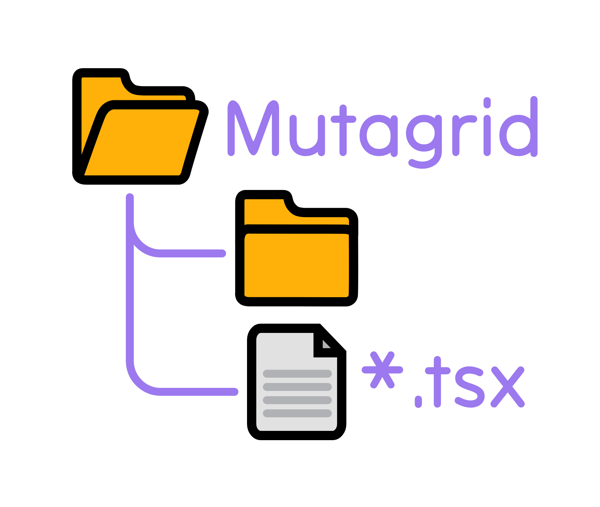
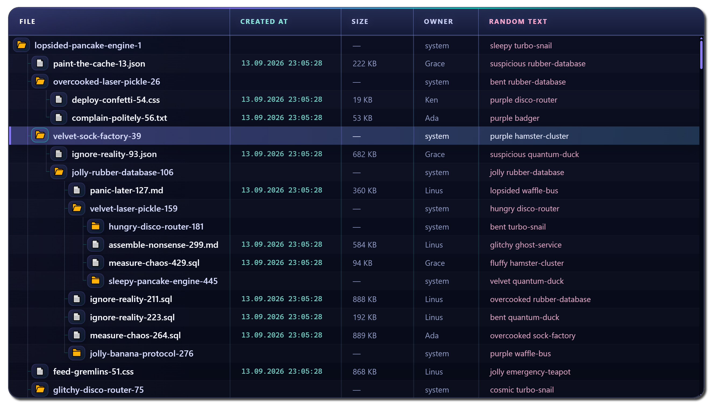

# Mutagrid

A React component library for rendering large virtualized trees and resizable columned tree views.

<p align="center">
  
</p>

> Mutagrid is currently in `0.x`. Its public API may change between minor releases.

## Try it out!

1. Clone the repository: `git clone git@github.com:losdayver/mutagrid.git`
2. Install dependencies with `npm install`
3. Run `npm run watch-dev`; the preview app will be available at `http://localhost:5173/`



## Installation

```bash
npm install mutagrid
```

## Basic usage

```tsx
import { ColumnedTreeView, type TreeViewNode } from "mutagrid";

type FileData = {
  name: string;
  size: string;
  modifiedAt: Date;
};

const forest: TreeViewNode<FileData>[] = [
  {
    data: {
      name: "src",
      size: "—",
      modifiedAt: new Date(),
    },
    isFolder: true,
    expanded: true,
    children: [
      {
        data: {
          name: "index.ts",
          size: "2 KB",
          modifiedAt: new Date(),
        },
      },
    ],
  },
];

export const FileExplorer = () => (
  <ColumnedTreeView<FileData>
    forest={forest}
    firstColumnTitle="Name"
    columnWidth={320}
    columns={{
      size: { title: "Size", width: 120 },
      modifiedAt: { title: "Modified", width: 200 },
    }}
    renderRowTitle={(node) => node.data.name}
    virtualScrollProps={{
      outerDivStyle: { height: 480 },
      rowHeight: 30,
    }}
    onClick={(node, event) => {
      if (event.button === 2) event.preventDefault();
      console.log(node.data.name);
    }}
  />
);
```

The row click handler receives both primary and context-menu clicks. A primary click that expands or collapses a folder is not forwarded to this handler.

## Components

- `VirtualScroll` renders only the currently visible rows.
- `TreeView` adds hierarchical nodes, indentation, connectors, icons, and folder expansion.
- `ColumnedTreeView` adds headers, data columns, and draggable column resizing.

## Styling

Mutagrid provides inline style props for each structural part of the components. Every styleable element also has a class name prefixed with `lsdvr-mutagrid-`, so the table can be styled with CSS without changing its layout rules.

```tsx
<ColumnedTreeView
  {...props}
  columnedTreeViewStyle={{ borderRadius: 12, overflow: "hidden" }}
  headerRowStyle={{ background: "#181c2e" }}
  headerCellStyle={{ padding: "0 12px", fontWeight: 600 }}
  dataCellStyle={{ padding: "0 12px" }}
  virtualScrollProps={{
    outerDivStyle: { height: 480 },
    viewportStyle: { scrollbarColor: "#777 transparent" },
    rowStyle: { borderBottom: "1px solid #ffffff10" },
  }}
/>;
```

For a complete styled example, see [`src/dev/previewApp.tsx`](./src/dev/previewApp.tsx) and [`src/dev/assets/virtual-scroll-styles.css`](./src/dev/assets/virtual-scroll-styles.css).

## Package format

Mutagrid is an ESM-only TypeScript library and generates TypeScript declarations during compilation.

## License

[MIT](./LICENSE)
